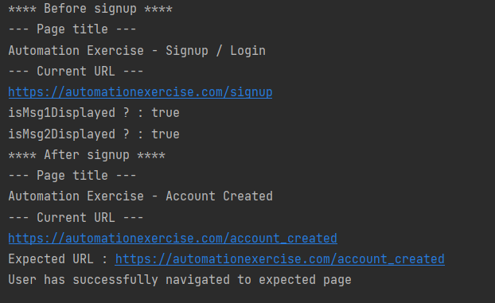

# Demos
* <a href="https://www.youtube.com/watch?v=K0AKYvGro68" >Registration Test</a>
* <a href="https://www.youtube.com/watch?v=v5faQmovugo&list=PLGF1xcxBG5GU" >Login Test</a>
* <a href="https://www.youtube.com/watch?v=7jrg4bm6IO0" >Manipuler Inputs</a>
* <a href="https://www.youtube.com/watch?v=R0Hwc1OZTP8" > Display "already exist email" message </a>
* <a href="https://www.youtube.com/watch?v=BpZDGkcwD1I" > Redirection vers la chaîne YouTube </a>
* <a href="https://www.youtube.com/watch?v=TmODjZ-SnYU" > manipuler les boutons </a>
* <a href="https://www.youtube.com/watch?v=qiEwMdm2BVY"> Test navigation </a>
* <a href="https://www.youtube.com/watch?v=ePl_QN-wjds" > Test Alert </a>
* <a href="https://www.youtube.com/watch?v=vuCAMUoATjM" > Test Dropdown </a>

# Sites Utilisés
* <a href="https://automationexercise.com/" > https://automationexercise.com/ </a>
* <a href="https://letcode.in/test"> https://letcode.in/test </a>
* <a href="https://the-internet.herokuapp.com/javascript_alerts"> https://the-internet.herokuapp.com/javascript_alerts </a>
* <a href="https://demo.nopcommerce.com/" > https://demo.nopcommerce.com/</a>

# WebDriver
WebDriver, c'est l'API de Selenium qui permet de contrôler automatiquement un navigateur (Chrome, Firefox, Edge, etc.) pour simuler les actions d'un utilisateur (cliquer, saisir du texte, naviguer...).  
<a href="https://mvnrepository.com/artifact/org.seleniumhq.selenium/selenium-java/4.45.0" >Selenium Java</a>

# JUnit Jupiter API
JUnit Jupiter API est l'API de JUnit 5 qui permet d'écrire et d'exécuter des tests unitaires en Java.
<a href="https://mvnrepository.com/artifact/org.junit.jupiter/junit-jupiter-api/6.1.1" >JUnit Jupiter API </a>

# Some results

# testNG
TestNG sert à automatiser les tests en Java (tests unitaires et d'intégration) et à organiser, exécuter et générer des rapports de tests.
<a href="https://mvnrepository.com/artifact/org.testng/testng/7.12.0">testNG 7</a>  
Je l'ai utilisé dans ce code pour se débarrasser des conditions if/else

# practice
<a href="https://letcode.in/button" > manipulate buttons </a>

# méthodes d’état (ou de vérification d’état) d’un élément WebElement.
- **isDisplayed()** → élément visible
- **isEnabled()** → élément activé
- **isSelected()** → élément sélectionné (checkbox/radio)